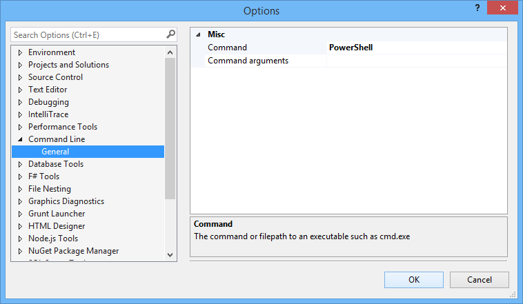
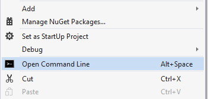

## Open Command Line
### A Visual Studio extension

Download from the
[Visual Studio Gallery](https://visualstudiogallery.msdn.microsoft.com/4e84e2cf-2d6b-472a-b1e2-b84932511379)
or get the
[nightly build](http://vsixgallery.com/extension/f4ab1e64-5d35-4f06-bad9-bf414f4b3bbb/)

## Supported consoles

The Open Command Line extension supports all types of consoles like cmd, PowerShell, Bash and more. You can easily configure which to use by setting the paths and arguments
in the Options.

### How it works

This extension adds a new command to the project context menu that will open
a command prompt on the project's path. If the solution node is selection in Solution
Explorer, then a console will open at the root of the .sln file.

You can access the command by hitting **ALT+Space** as well.

You may change this shortcut in the Options Window under Environment -> Keyboard

Look for the command ProjectAndSolutionContextMenus.Project.OpenCommandLine.Default

### Execute batch file

You can easily execute any .cmd or .bat file. For files in your solution,
a context-menu button shows up.

Alternatively, the keyboard shortcut `Shift+Alt+5` can be used when
editing a batch file. This makes it really easy and fast to execute
any batch file - even ones that are not part of your project.

## License
[Apache 2.0](LICENSE)